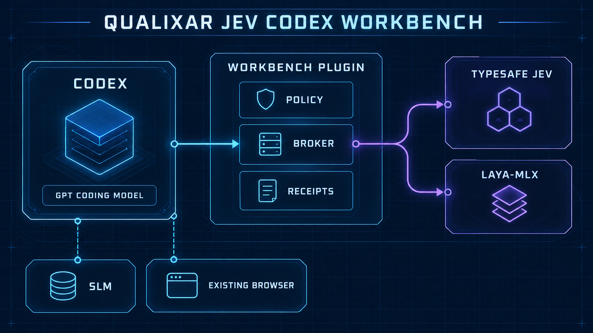
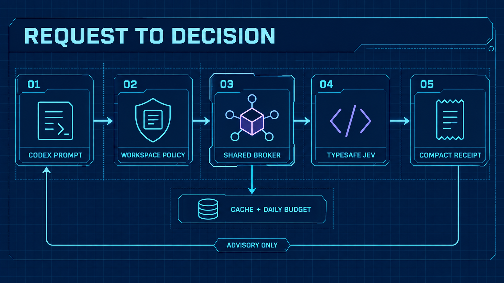
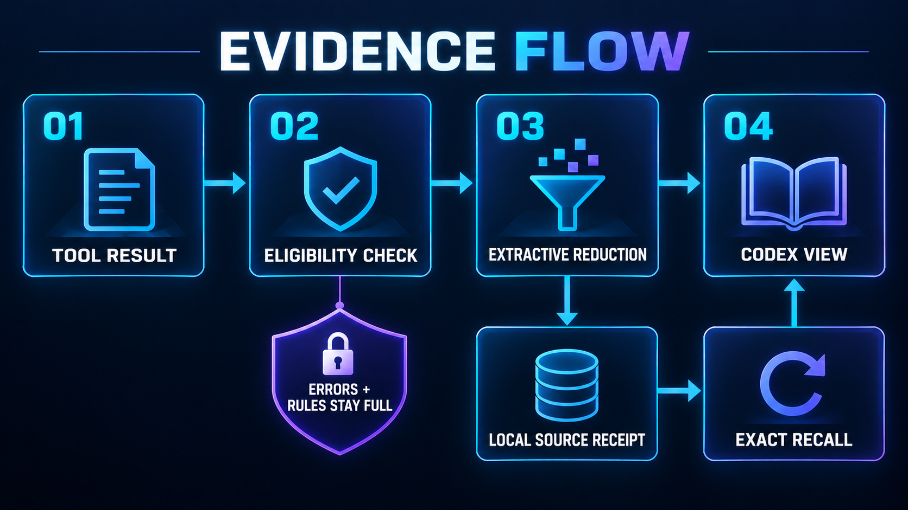
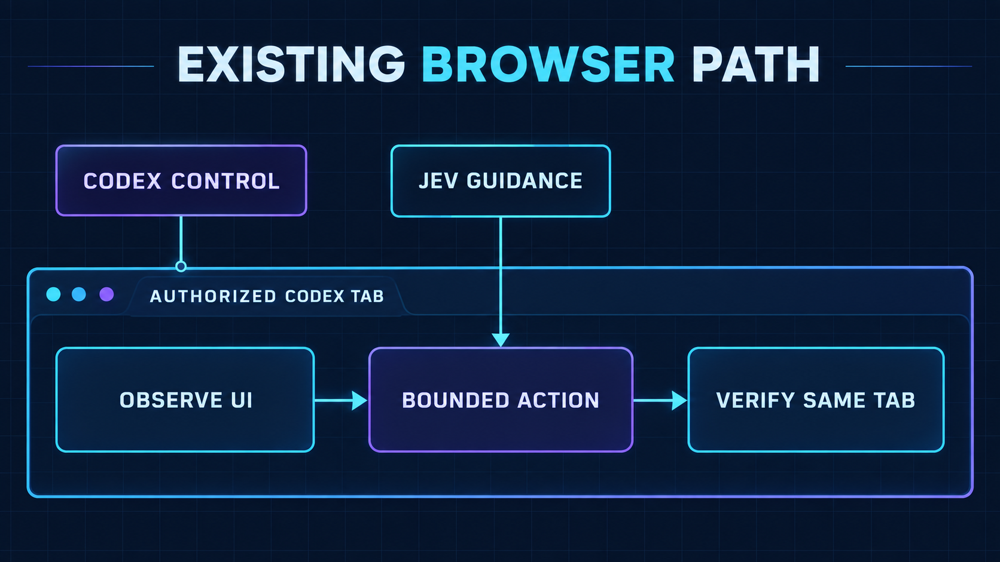

# Qualixar Jev Codex Workbench

[](https://m8ven.ai/mcp/qualixar/jev-codex-workbench)

**An open-source Codex plugin and MCP server for bounded AI coding agent decisions and recoverable context.** The workbench adds TypeSafe Jev around the coding model you already use in Codex. Jev handles narrow semantic judgments; Codex remains responsible for code, tools, and execution. Version **1.1.3** adds standing workspace enrollment, compact receipts, extractive tool-output reduction, shared budgets, and an optional local Laya-MLX route.

The workbench targets two sources of wasted work: exploring too many candidate files or tools before a narrow decision, and carrying large successful tool outputs through Codex context when only a few source lines matter. It can reuse a decision for an identical request and retrieve omitted evidence exactly when needed. The mechanism is visible below; actual token and time savings still require matched accepted-task measurements.



*Architecture overview. The provider branches are decision routes; neither provider receives execution authority. The browser path is included in 1.1.3 but still needs native host acceptance before broad use.*

This is an independent open-source integration from **Qualixar**, created by **Varun Pratap Bhardwaj**. It is not an official OpenAI or TypeSafe product.

## What 1.1.3 adds

| Capability | What it does | Boundary |
|---|---|---|
| Standing workspace operation | The owner enrolls a reviewed workspace once with an expiry and daily call/byte limits. | Enrollment records a classification label but cannot detect confidential prose; native Codex permissions remain in force. |
| Compact Jev results | Codex sees a small decision and a receipt ID. | The full receipt and a local copy of supplied evidence remain recoverable with `jev_recall`; an explicit remote call transmits its selected state to the configured provider. |
| Extractive output reduction | Eligible long plain-text tool results can be shortened by keeping relevant source blocks. | Automatic hook filtering requires a local Laya-MLX `sieve` route; errors, constraints, instruction files, uncertain blocks, and structured SLM output are preserved. |
| Shared broker | Parent and child work in one workspace share the budget, content-addressed cache, and coalesced identical calls. | A cache hit is labelled; it is not a second provider judgment. |
| Optional Laya-MLX | A pinned local model can handle selected small `sieve` and `probe` routes on Apple Silicon. | Codex keeps its selected coding model; large-context and browser routes remain on Jev unless separately evaluated. |
| Existing-browser bridge | The bridge runs short bounded bursts in Codex's already authorized tab. | No second browser is installed; Codex verifies the final page independently. |
| Measurement tools | Record matched accepted tasks, host usage, elapsed time, and provider/local costs. | No universal token or cost saving is claimed without those measurements. |

The workbench retains the seven original MCP tools and adds `jev_auto_status`, `jev_prepare`, `jev_reduce`, and `jev_recall`. The 20 supplied workflows and their fixtures remain available. Fixtures are simulated contract checks, not live Jev accuracy results.

## Install the Codex plugin

Use Python **3.11+** and a Codex installation with the `codex` CLI. The installer needs a private terminal because it asks for your selected provider credential without echoing it.

```bash
git clone https://github.com/qualixar/jev-codex-workbench.git
cd jev-codex-workbench
python3 scripts/install.py
```

Quit and reopen Codex after installation. Review the changed `qualixar-jev-control@qualixar-jev` hooks in the Codex CLI before relying on hook behavior. The plugin's MCP tools and its lifecycle hooks have separate readiness states. See [Hook trust](docs/TRUSTING_HOOKS.md).

**Already using 1.1.2?** Follow the [source-aware upgrade steps](docs/UPGRADE_1_1_3.md). An old marketplace source can reinstall 1.1.2 even when your new checkout contains 1.1.3.

### Enroll one workspace

Installation alone does not permit live judgments on a workspace. In a private terminal, choose a workspace and review the policy shown before typing `ENABLE`:

```bash
python3 auto_entry.py enroll \
  --workspace /absolute/path/to/reviewed-workspace \
  --provider existing \
  --classification public \
  --days 30 --daily-calls 1000 --daily-bytes 20000000
```

Use `internal-minimized` only for excerpts you are allowed to send to the selected provider. Add each browser origin you approve with a repeated `--browser-origin` flag when enrolling; browser access and permission to share page text are separate decisions. The enrolled workspace shares one standing budget across turns and child work. Changing a file may require a fresh decision, but it does not revoke the enrollment. Revoke with `python3 auto_entry.py revoke --workspace /absolute/path/to/reviewed-workspace`.

For an unenrolled workspace, the original grant-based `jevkit` path remains available. See [legacy live validation](docs/LIVE_VALIDATION.md).

**Across folders:** The plugin is installed once for Codex and its tools are available globally. Enrollment follows the Git workspace root, so subfolders of one repository share the standing policy, budget, and cache. A different repository needs its own one-time enrollment before automatic Jev/Laya operation; the local MLX model itself is installed only once on the machine. You do not repeat enrollment for each task or code edit. Native Codex tool and browser permissions still apply.

### Check the installation

```bash
codex plugin list
python3 auto_entry.py status --workspace /absolute/path/to/reviewed-workspace
python3 auto_entry.py start --workspace /absolute/path/to/reviewed-workspace
```

In a fresh Codex task, ask `jev_auto_status` for that workspace. It reports the broker version and observed counters without making a provider judgment. You can also run the offline catalog and fixtures with `jev_catalog`, `jev_describe`, and `jev_run_fixture` before enrolling.

## The request path



Codex supplies a bounded question and evidence. The workspace policy checks the allowed provider route, expiry, recipe, and shared budget. Its classification label records the owner's choice; it does not classify text. The broker returns a cached answer when the exact request is still valid, coalesces identical simultaneous requests, or asks Jev for a fresh judgment. The MCP facade returns a compact status and receipt ID. **Jev never authorizes a shell command, edit, deployment, or completion claim.** Review explicit remote-call input before it is sent.

A live response can be `RECOMMEND`, `REVIEW`, or `BLOCK` under the workflow policy. `REVIEW` and `BLOCK` are useful outcomes; they must not be recast as success. A provider failure leaves Codex's ordinary work available, without switching providers or spending beyond the workspace policy.

## The evidence path



The reducer keeps source text rather than writing a summary. If it omits a range, the compact view names the line numbers and a local receipt. `jev_recall` restores that exact source range. Failed commands, mandatory instructions, constraints, and uncertain material are kept. Structured SLM results are not generically rewritten. Automatic hook reduction runs only when the owner selected the local `sieve` route, so a new tool result is not silently sent to a remote provider. An unsupported host output path leaves the original result available.

In an installed local check using synthetic text, `jev_reduce` withheld 1,878 characters while keeping a required line, and `jev_recall` restored an omitted range exactly. This checks the explicit tools; it is **not** a measurement of host tokens saved or proof that every native `PostToolUse` rewrite path works.

## Optional local Laya-MLX

On a supported Apple Silicon Mac, the separate installer downloads a pinned public checkpoint into a private local environment. It does not train a model or replace the Codex coding model.

```bash
python3 scripts/install_laya_mlx.py --checkpoint english
python3 auto_entry.py route-local \
  --workspace /absolute/path/to/reviewed-workspace \
  --recipe sieve --recipe probe
python3 auto_entry.py warmup --workspace /absolute/path/to/reviewed-workspace
python3 auto_entry.py probe --workspace /absolute/path/to/reviewed-workspace
```

The installer asks the owner to type `INSTALL`; routing asks for `LOCAL`. The worker remains resident after warmup. The probe reports whether it ran actual local inference or returned a recorded cache result. The English checkpoint's input limits are enforced before inference; an oversized or unavailable local route preserves the original text rather than silently sending it to Jev. See [Laya-MLX setup](docs/JEV_AUTO_1_1_3.md).

## Existing browser path



The bridge observes the authorized tab's accessibility state, chooses among observed controls, takes a short bounded action, and hands control back for independent verification in that same tab. It uses a private local socket. It does not start Playwright, CDP, or a replacement browser. On this release candidate, a native Codex browser run reached the broker, executed one observed action in the existing tab, and independently verified the destination heading. The bridge also enforces the owner's enrolled step cap. The included mocked browser tests cover additional contract and failure paths.

## Verify and measure

Run the repository gates from a clean checkout:

```bash
PYTHONDONTWRITEBYTECODE=1 python3 -m unittest discover -s tests -v
PYTHONDONTWRITEBYTECODE=1 python3 jev.py suite
node --test tests/jev_auto_browser.test.mjs
python3 scripts/verify_package.py
```

The manifest check reports differences if you have uncommitted source edits; run it against the exact release candidate. Before claiming savings, compare the same accepted task and coding model with and without the workbench. Include retries, elapsed time, host input/output tokens, Jev calls, and local compute separately. Cached host input is a subset of input, not extra usage. Unknown measurements remain unknown. The included measurement tools and acceptance protocol are documented in [the 1.1.3 implementation notes](docs/JEV_AUTO_1_1_3.md).

See the [1.1.3 validation note](docs/RELEASE_VALIDATION_1_1_3.md) for the checks performed on the release candidate and the limits of the current measurements.

## Trust boundary and repository map

The plugin runs inside Codex's native plugin and MCP mechanisms. Native permissions still decide what Codex may execute. Workspace enrollment governs Jev requests; it does not grant filesystem or browser authority or automatically recognize ordinary confidential prose. Automatic prompt preparation and hook-based output reduction stay local. Explicit calls using a remote route transmit the supplied state to the selected provider, so the operator must review that material. Browser origins are explicit. Credentials stay in the owner's private provider store, outside this repository. SuperLocalMemory remains a separate memory system; this release neither migrates its database nor replaces its plugin.

| Path | Purpose |
|---|---|
| `plugins/qualixar-jev-control/` | Installable Codex plugin, hooks, skills, and packaged runtime. |
| `jev_auto/` and `auto_entry.py` | Standing workspace broker, policy, local receipts, MCP facade, and CLI. |
| `jevkit/` and `jev.py` | Original workflows, fixture contracts, provider integration, and legacy path. |
| `use_cases/` and `fixtures/` | 20 bounded workflows and simulated contract fixtures. |
| `tests/` | Unit, transport, compatibility, and browser bridge tests. |
| `docs/ARCHITECTURE_1_1_3.md` | Detailed request, storage, and trust flows. |

Read [Security](SECURITY.md), [Contributing](CONTRIBUTING.md), and [third-party notices](THIRD_PARTY_NOTICES.md) before extending or redistributing the workbench.

## License

MIT. Copyright © 2026 Varun Pratap Bhardwaj / Qualixar. TypeSafe, Jev, OpenAI, Codex, and other third-party names and trademarks belong to their respective owners. This repository does not redistribute model weights or TypeSafe's official skill.
